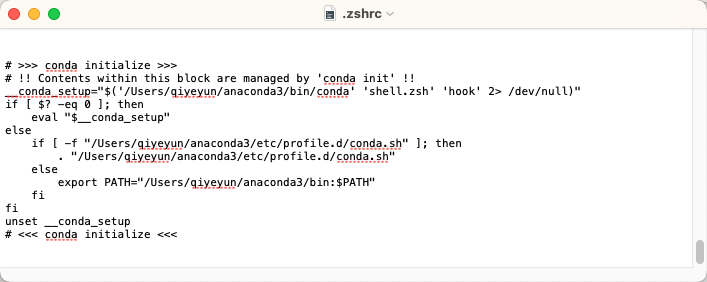

* [官方文档](https://docs.anaconda.com)
    * [Installing on macOS](https://docs.anaconda.com/anaconda/install/mac-os/)
    * [Uninstalling Anaconda Distribution](https://docs.anaconda.com/anaconda/install/uninstall/)


* Anaconda Navigator

    * [Installing Anaconda  Navigator](https://docs.anaconda.com/navigator/install/#id2)

        Navigator is automatically installed when you install [Anaconda Distribution](https://docs.anaconda.com/anaconda/install/) version 4.0.0 or higher.

    * Uninstalling Anaconda Navigator

        ```bash
        $ conda remove anaconda-navigator
        ```

        


# Conda环境变量

conda initialize 变量是安装时，自动添加的




打开mac终端，输入：

```bash
➜ ~ conda --version

zsh: command not found: conda
```

添加命令：

```bash
$ echo 'export PATH="/Users/qiyeyun/anaconda3/bin:$PATH"' >> ~/.zshrc
```

解释说明：echo是返回字符串的命令，~/目录是家目录，即/Users/<个人用户名>。两个>(英文半角下的大于号)表示不改变后面文件中的原有内容，添加引号中的内容，有这个文件会自动新建。为什么是.zshrc文件呢，因为我的终端打开用的是-zsh工具。

总之就是，将单引号中的内容写到~/目录下的.zshrc文件中。

激活命令：

```bash
$ source ~/.zshrc
```


# Conda自带Python

```bash
$ which python
/Users/linxiang/anaconda3/bin/python

$ which python3
/Users/linxiang/anaconda3/bin/python3
```


