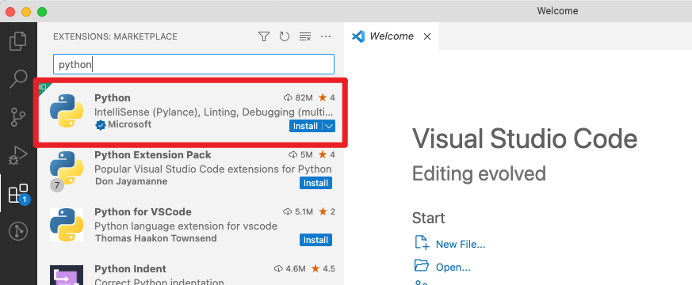
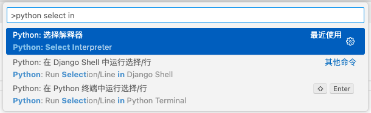
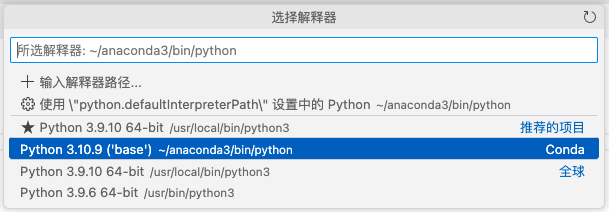
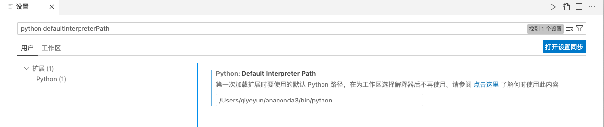
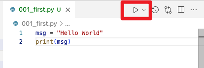
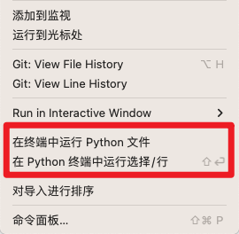
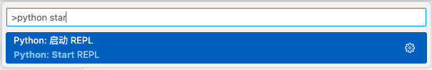
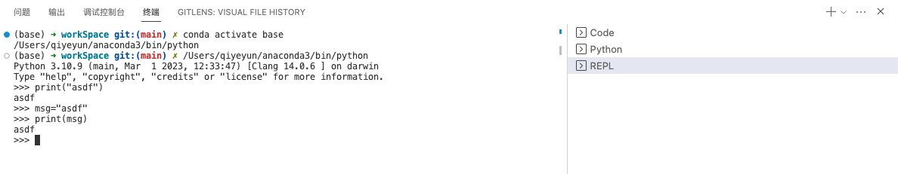
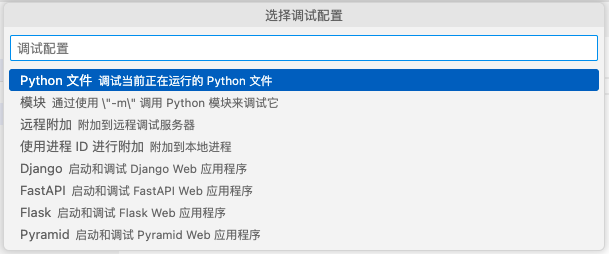
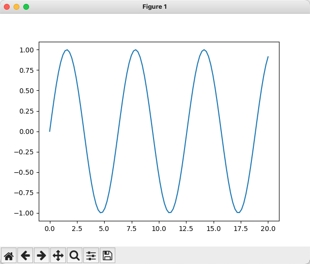

- [VSCode官网_Getting Started with Python in VS Code](https://code.visualstudio.com/docs/python/python-tutorial)


# 必备三要素

- Python 3 （Python解释器，已通过Anaconda安装）
- VS Code
- [VS Code Python extension](https://marketplace.visualstudio.com/items?itemName=ms-python.python)




**验证Python安装**

```bash
$ python3 --version
Python 3.10.9

$ which python
/Users/qiyeyun/anaconda3/bin/python

$ which python3
/Users/qiyeyun/anaconda3/bin/python3
```


**VSCode中选择Python解析器**






**Python解释器默认路径**




**Python运行方式**










**Python Debug - 精简**

* 断点  F9
* 初始化调试 F5，第一次会弹出配置页面，后面就不会弹出了
* 
* continue (F5), step over (F10), step into (F11), step out (⇧F11), restart (⇧⌘F5), and stop (⇧F5).


For full details

**[Debugging configurations](https://code.visualstudio.com/docs/python/debugging) - 详细**


# 安装与使用包

```python
import matplotlib.pyplot as plt
import numpy as np

x = np.linspace(0, 20, 100)  # Create a list of evenly-spaced numbers over the range
plt.plot(x, np.sin(x))       # Plot the sine of each x point
plt.show()                   # Display the plot
```

* matplotlib (Anaconda安装)
* numpy (Anaconda安装)




#  [Environments](https://code.visualstudio.com/docs/python/environments#_creating-environments)

**Python environment tools**

The following table lists the various tools involved with Python environments:

|                        Tool                         | Definition and Purpose                                       |
| :-------------------------------------------------: | :----------------------------------------------------------- |
|             [pip](https://pip.pypa.io/)             | The Python package manager that installs and updates packages. It's installed with Python 3.9+ by default (unless you are on a Debian-based OS; install `python3-pip` in that case). |
| [venv](https://docs.python.org/3/library/venv.html) | Allows you to manage separate package installations for different projects and is installed with Python 3 by default (unless you are on a Debian-based OS; install `python3-venv` in that case) |
|           [conda](https://docs.conda.io/)           | Installed with [**Miniconda**](https://docs.conda.io/en/latest/miniconda.html). It can be used to manage both packages and virtual environments. Generally used for data science projects. |


# [Data Science in Visual Studio Code](https://code.visualstudio.com/docs/datascience/overview)


Jupyter Notebooks in VS Code


