> # 新手建议直接安装Anaconda，无需手动安装Python

* [Python官网](https://www.python.org)
* [MAC OSX 正確地同時安裝 PYTHON 2.7 和 PYTHON3](https://stringpiggy.hpd.io/mac-osx-python3-dual-install/#step2)

## 一、安装Python3

使用HomeBrew安装，具体使用可参考 [HomeBrew的日常使用](https://www.jianshu.com/p/2fa264b93f06)

利用 homebrew 搜尋 Python3：`$ brew search python3`

这里，我已经安装过了，所以出现了✔

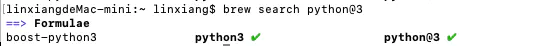

如果未安装，则执行如下命令安装：`$ brew install python3`

如果安装失败！！！

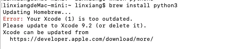

解决方案：
但是 Xcode 确实已经更新到了最新版本
此时需要使用 `$ brew update` 来更新 Homebrew
并终端中执行命令 `$ brew update-reset`
然后再次进行安装`$ brew install python3`


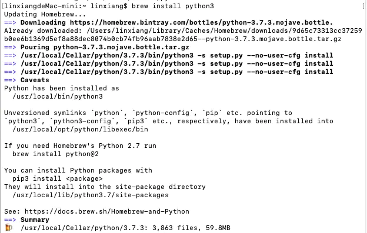


如何查看python3安装路径：`$ brew list python`


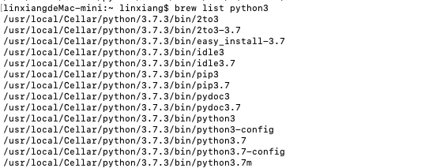

从上图可以发现python3的安装路径，并打开： `$ open /usr/local/Cellar/`

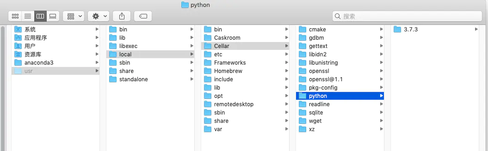


## 二、系统自带Python2与自定义安装python2

首先，輸入：`python --version`

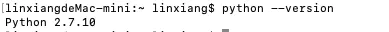

天哪！都還沒開始裝 Python，電腦裡面怎麼已經有了？
這是 Mac 系統要使用的 Python，所以平常没事不要去亂動比較好唷！
系统自带Python路径`/user/bin/`

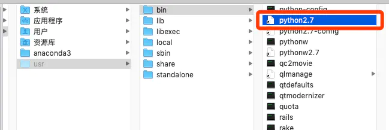

所以現在我們要用 homebrew 來安裝平常可以（亂搞？）使用的 Python。

利用 homebrew 安装 Python2
当我们安装python3时，有一些额外的提示：`$ brew install python@2`

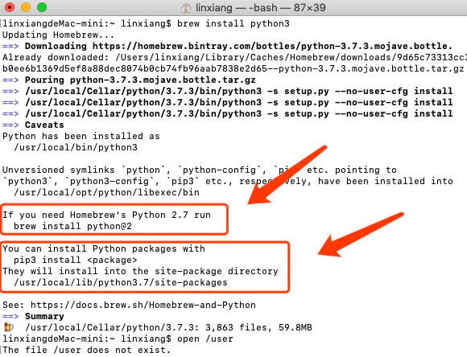

安装`$ brew install python@2`

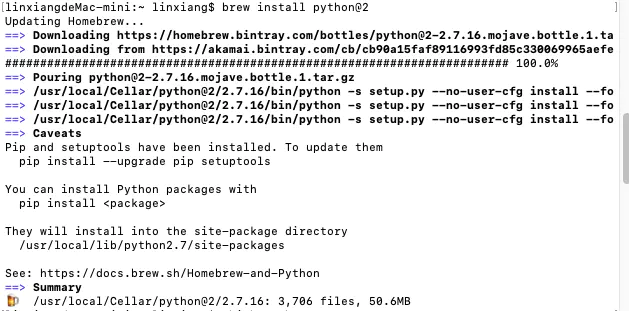

如果使用 `$ brew install python`，看得出来，默认是安装的python3

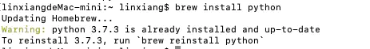

如何查看python2安装路径：`$ brew list python@2`

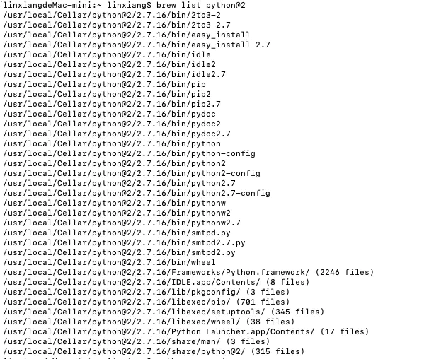

从上图可以发现python3的安装路径，并打开： `$ open /usr/local/Cellar/`

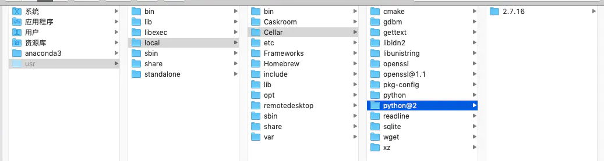


## 三、设定路径 $PATH（不跟系統 Python 打架）

此时查看 `$ python --version`，会发现依旧是系统自带Python的版本号。
这时候就需要我们进行路径$PATH的配置

什麼是路徑 $PATH 呢？

還記得我們在裝 Python 的時候，輸入了 brew，
系統就自動會知道要開始跑 homebrew。
系統到底怎麼知道我們的 brew 在哪裡？
這就是 $PATH 的用途了！

```
$ echo $PATH
```
接下來就會看到一串類似這樣的東西

```
/usr/bin:/bin:/usr/sbin:/sbin:/usr/local/bin
```


分號 (:) 是分隔的意思
所以當你在 terminal 裡面輸入 brew 時
系統就會開始從 /usr/bin 找起
如果在 /usr/bin 裡面找不到的話
就會往下一個 /bin 去搜尋，以此類推

現在，我們回到資料夾去看
brew 其實就在 /usr/local/bin 裡面！

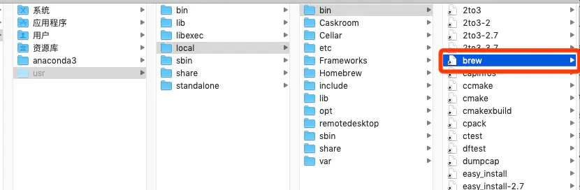


所以現在的問題就是，系統在 /usr/bin 裡面也有一份 Python
現在我們在 /usr/local/Cellar 裡面也裝了 Python
這樣在 terminal 打上 python 指令時，誰會被開啟呢？
因為路徑有順序，所以它會先找到系統的 Python
現在就要來解決這個問題

```
sudo emacs  /etc/paths
```

sudo 讓我們取得管理員權限
用 emacs 這個程式編輯路徑檔案
terminal 會要求輸入密碼（就是平常裝東西也需要輸入的密碼）
現在要把 /usr/local/bin 移到上面去

control + k：把一行字剪下來
control + y：把字貼上
control + x + s：存檔
control + x + c：關掉 emacs

這時，再打一次

```
echo  $PATH
```
為什麼沒有變！？
因為要`開一個新的 terminal`才會更新唷！
開新式窗後再輸入一次就會看到我們剛剛修改的結果了。

```
/usr/local/bin:/usr/bin:/bin:/usr/sbin:/sbin
```

用 `$ which python` 和 `$ python --version` 检验

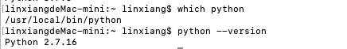

发现使用的已经是我们自定义安装的Python了。
