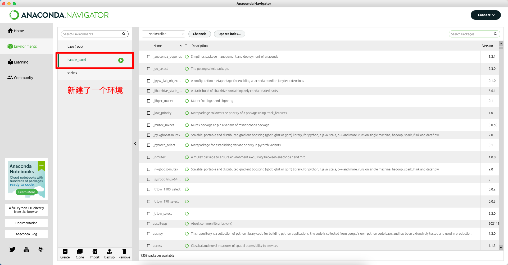
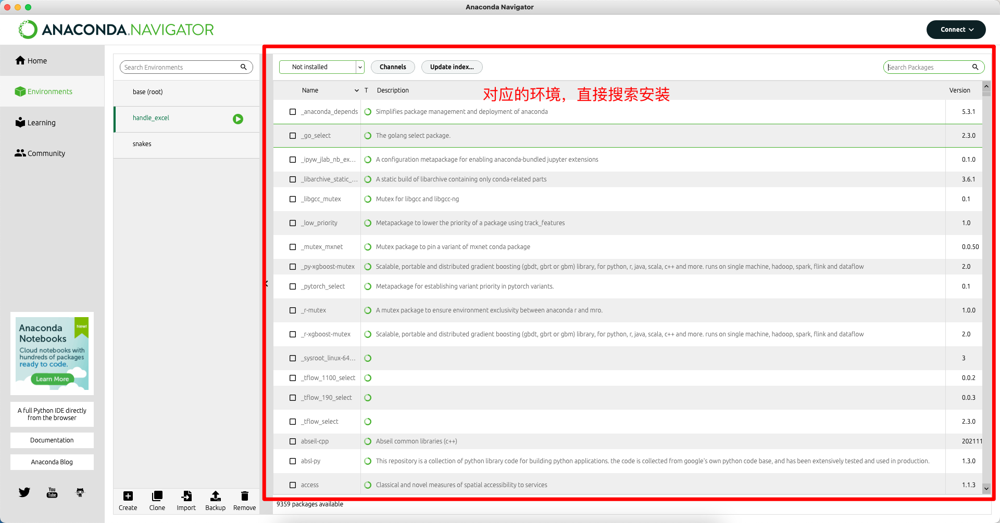
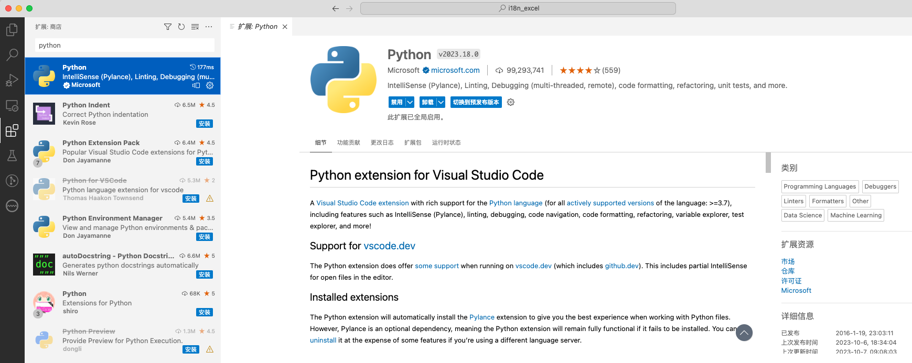
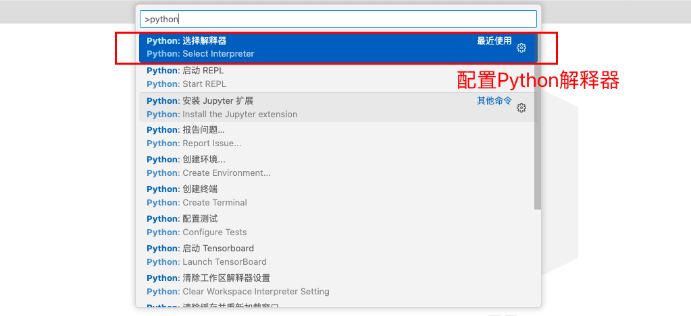
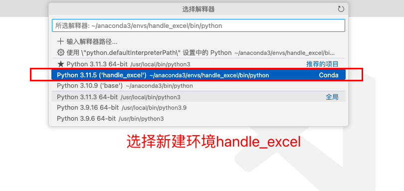
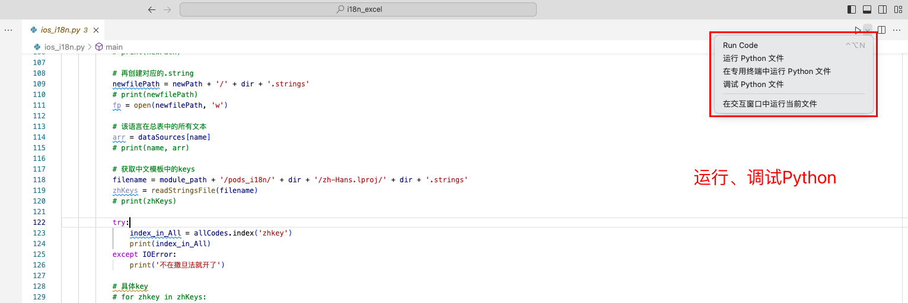

# 环境配置



## 终端查看环境

```sh
# 在终端中查看
$ which python3
/Users/qiyeyun/anaconda3/bin/python3
```


## 安装Python三方库




# VSCode配置Python










## VSCode查看环境

```sh
$ which python3
/Users/qiyeyun/anaconda3/envs/handle_excel/bin/python3
```


# VSCode运行Python



或者 手动运行

```sh
$ python -u "/Users/qiyeyun/Desktop/i18n_excel/ios_i18n.py"       
```


